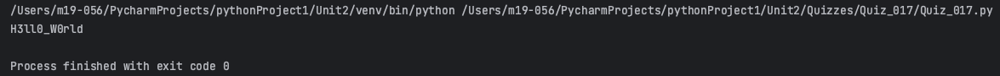
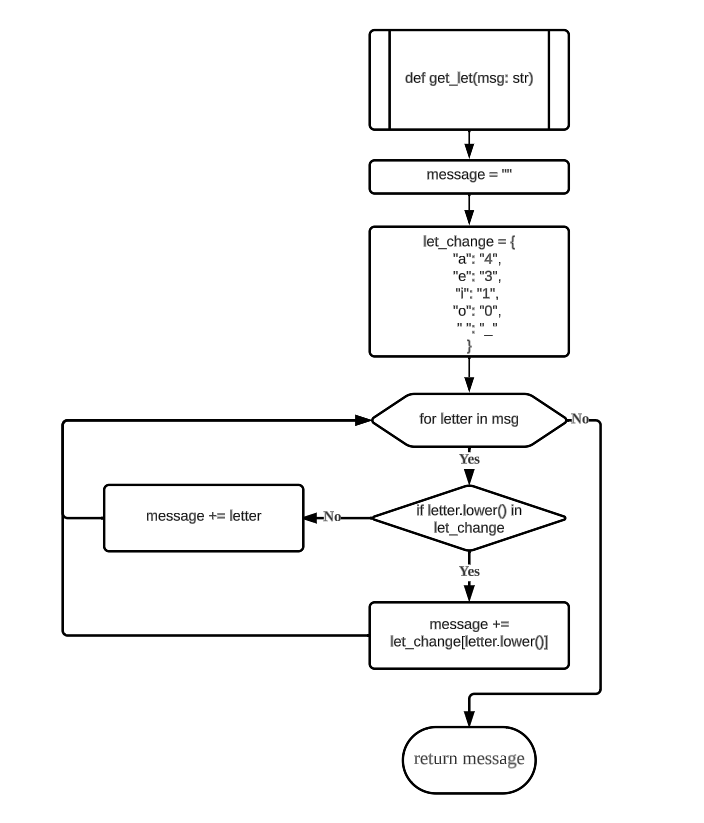
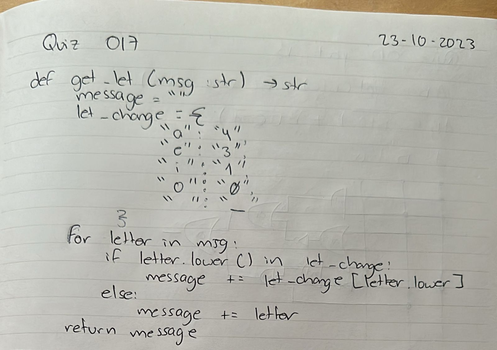
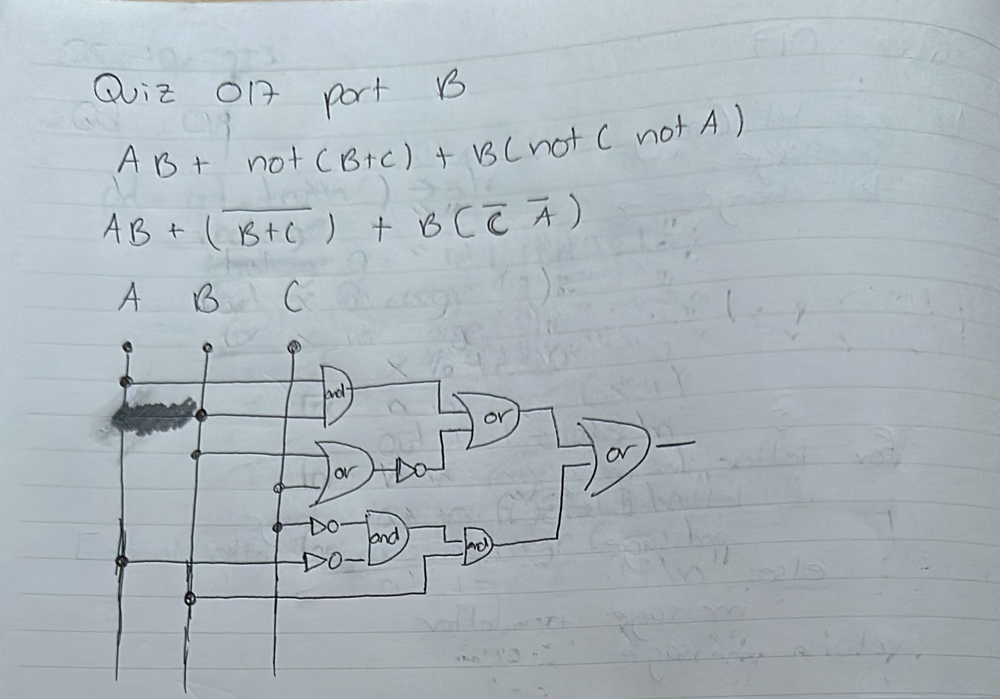

# Quiz 017
## Create a function that changes the vowels in a string to numbers such as a=4,e=3,i=1,o=0 and space by _
### Python code
```.py
def get_let(msg: str) -> str:
    message = ""
    let_change = {
        "a": "4",
        "e": "3",
        "i": "1",
        "o": "0",
        " ": "_"
    }
    for letter in msg:
        if letter.lower() in let_change:
            message += let_change[letter.lower()]
        else:
            message += letter

    return message

print(get_let("Hello World"))
```

### Proof


**Fig.1:** Proof of the Quiz 017

### Flow Chart


**Fig.2:** Flow Chart of the Quiz 017

### Work on paper


**Fig.3:** Work on paper of the Quiz 017

### Part B


**Fig.4:** Part B of the Quiz 017