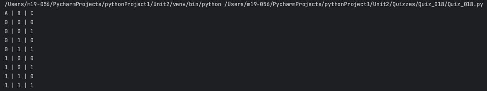
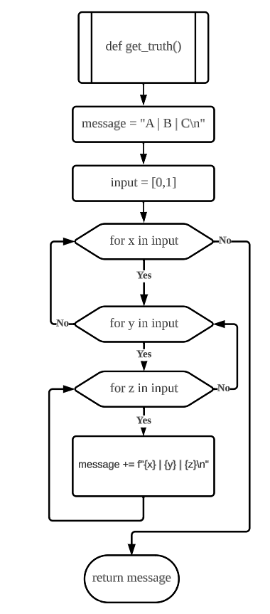
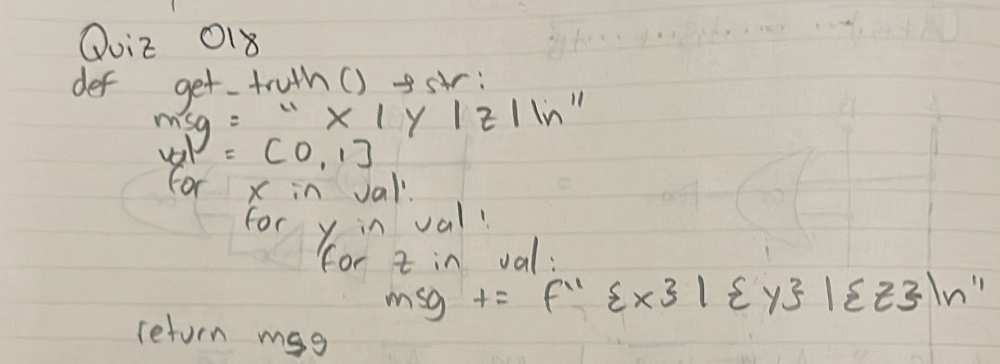
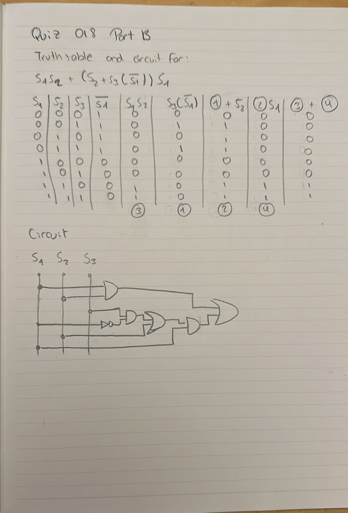

# Quiz 018
## Create a function that produces the table of Truth for 3 inputs:
### Python code
```.py
def get_truth() -> str:
    message = "A | B | C\n"
    input = [0, 1]
    for x in input:
        for y in input:
            for z in input:
                message += f"{x} | {y} | {z}\n"
    return message

print(get_truth())
```

### Proof


**Fig.1:** Proof of the Quiz 018

### Flow Chart


**Fig.2:** Flow Chart of the Quiz 018

### Work on paper


**Fig.3:** Work on paper of the Quiz 018

### Part B


**Fig.4:** Part B of the Quiz 018