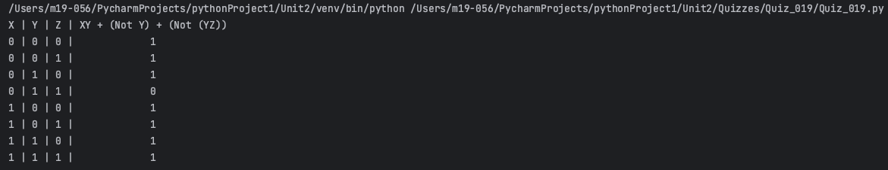
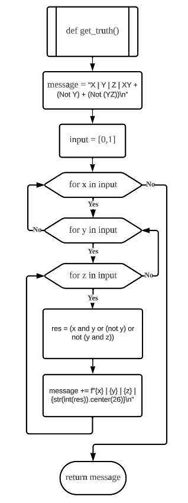
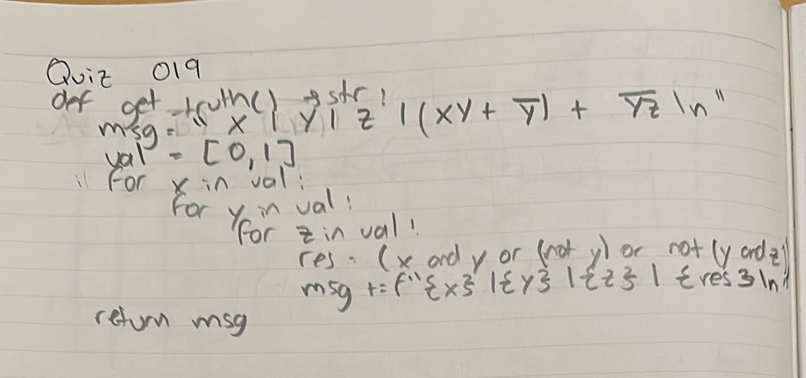
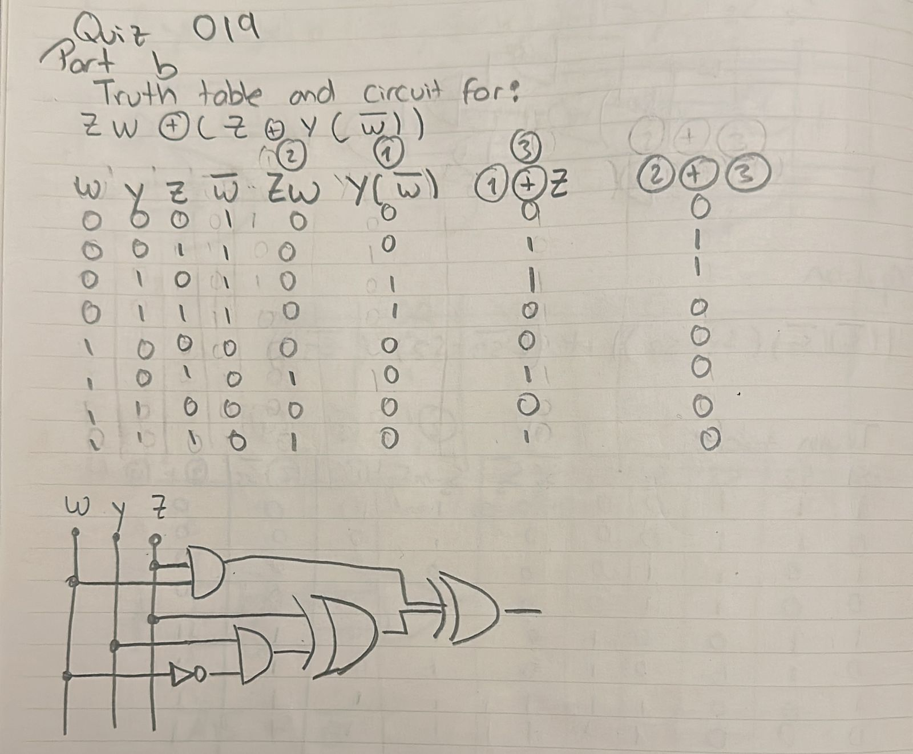

# Quiz 019
## Using the function that produces the table of Truth for 3 inputs, add a column for the boolean equation
### Python Code
```.py
def get_truth() -> str:
    message = "X | Y | Z | XY + (Not Y) + (Not (YZ))\n"
    val = [0, 1]
    for x in val:
        for y in val:
            for z in val:
                res = (x and y or (not y) or not (y and z))
                message += f"{x} | {y} | {z} | {str(int(res)).center(26)}\n"
    return message

print(get_truth())
```

### Proof


**Fig.1:** Proof of the Quiz 019

### Flow Chart


**Fig.2:** Flow Chart of the Quiz 019

### Work on paper


**Fig.3:** Work on paper of the Quiz 019

### Part B


**Fig.4:** Part B of the Quiz 019