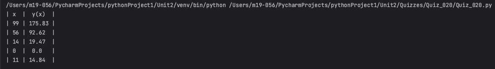
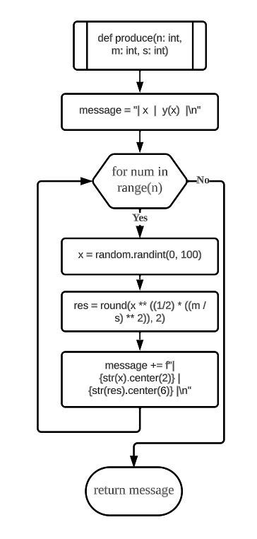
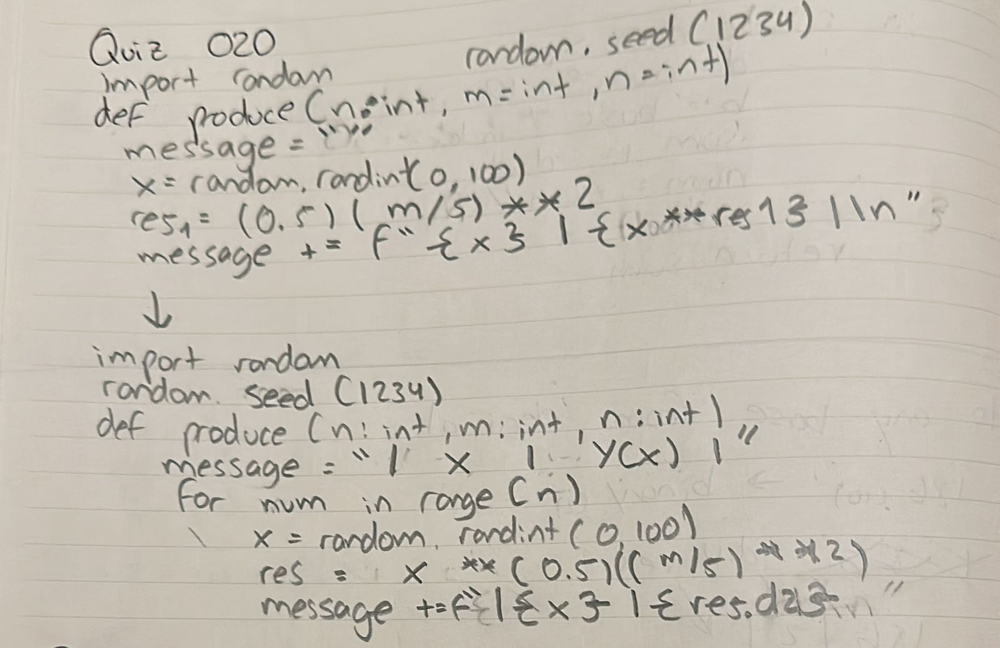
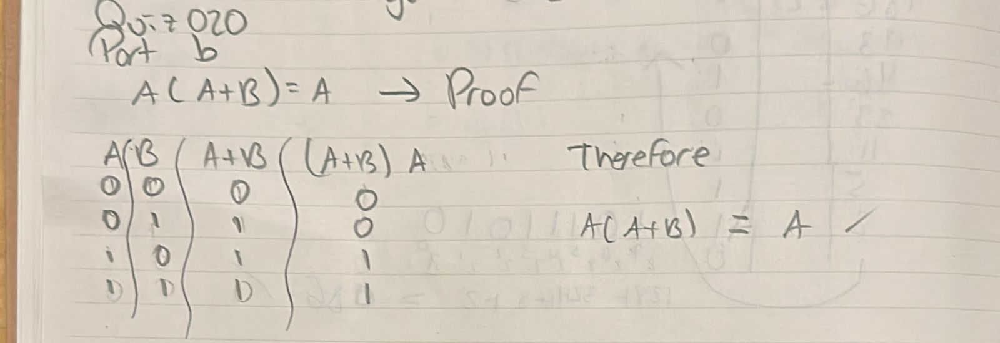

# Quiz 020
## Create a program that produces n random values from the equation below, where m and s are the other inputs of the function 
### Python Code
```.py
import random

random.seed(1234)


def produce(n: int, m: int, s: int):
    message = "| x  |  y(x)  |\n"
    for num in range(n):
        x = random.randint(0, 100)
        res = round(x ** ((1/2) * ((m / s) ** 2)), 2)
        message += f"| {str(x).center(2)} | {str(res).center(6)} |\n"
    return message

print(produce(n=5, m=3, s=2))
```

### Proof


**Fig.1:** Proof of the Quiz 020

### Flow Chart


**Fig.2:** Flow Chart of the Quiz 020

### Work on paper


**Fig.3:** Work on paper of the Quiz 020

### Part B


**Fig.4:** Part B of the Quiz 020