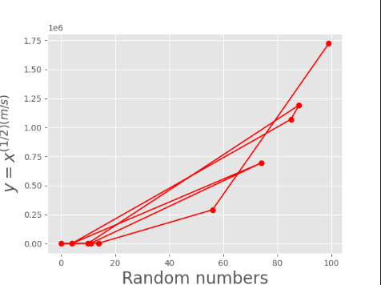
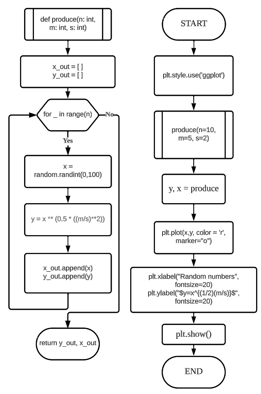
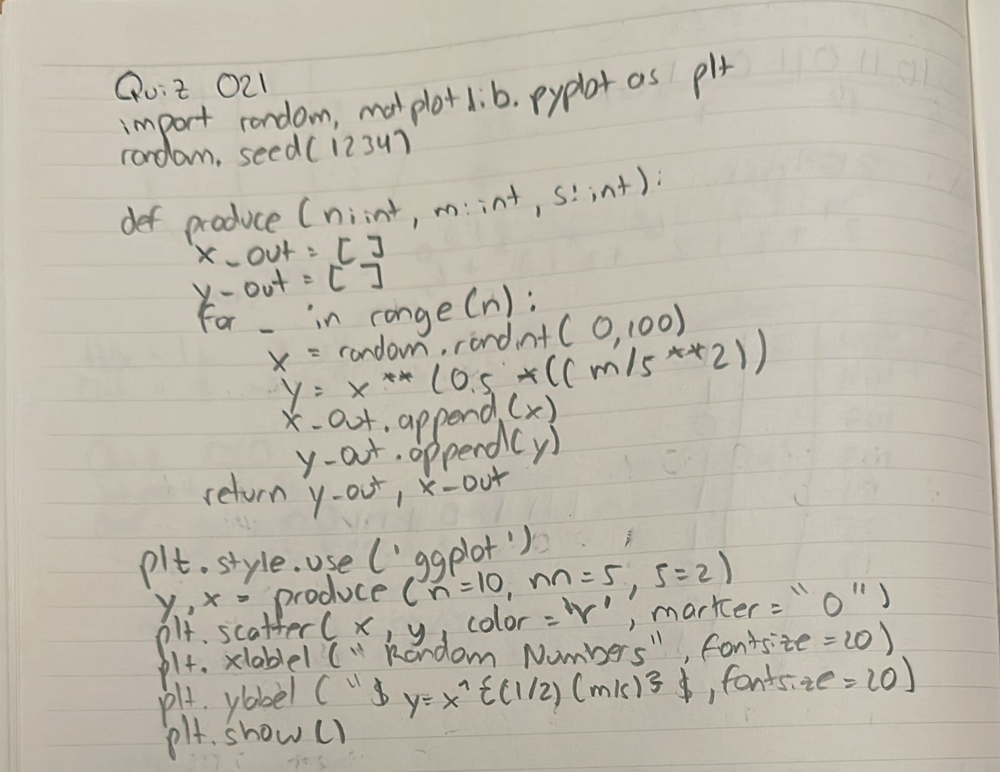
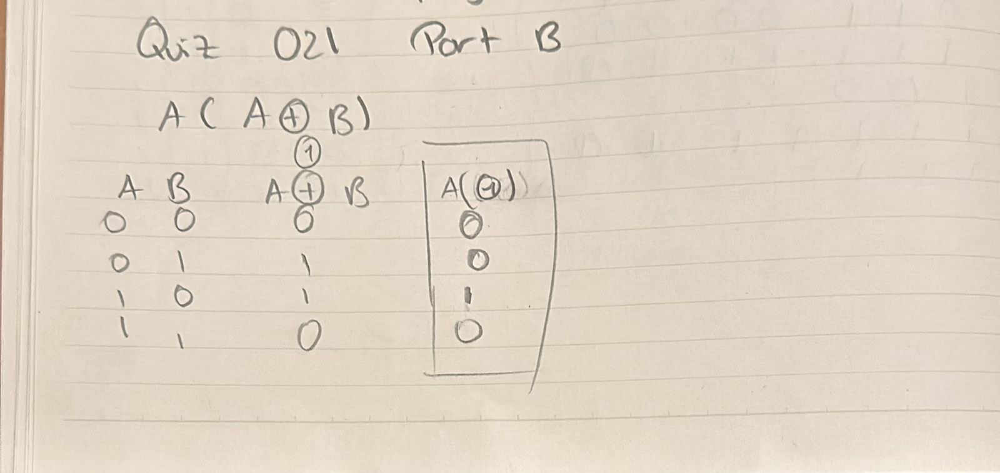

# Quiz 021
## Create a program that produces the graph for the function in Quiz #22  
### Python code
```.py
import random, matplotlib.pyplot as plt
random.seed(1234)
def produce(n:int, m:int, s:int):
    x_out = []
    y_out = []
    for _ in range(n):
        x = random.randint(0,100)
        y = x ** (0.5 * ((m/s)**2))
        x_out.append(x)
        y_out.append(y)

    return y_out, x_out

plt.style.use('ggplot')

y, x = produce(n=10, m=5, s=2)

plt.plot(x,y, color = 'r', marker="o")
plt.xlabel("Random numbers", fontsize=20)
plt.ylabel("$y=x^{(1/2)(m/s)}$", fontsize=20)
plt.show()
```

### Proof


**Fig.1:** Proof of the Quiz 021

### Flow Chart


**Fig.2:** Flow Chart of the Quiz 021

### Work on paper


**Fig.3:** Work on paper of the Quiz 021

### Part B


**Fig.4:** Part B of the Quiz 021