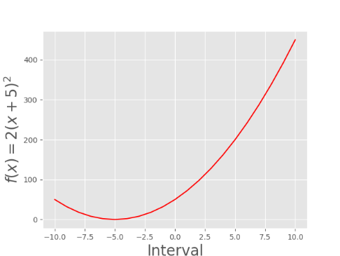
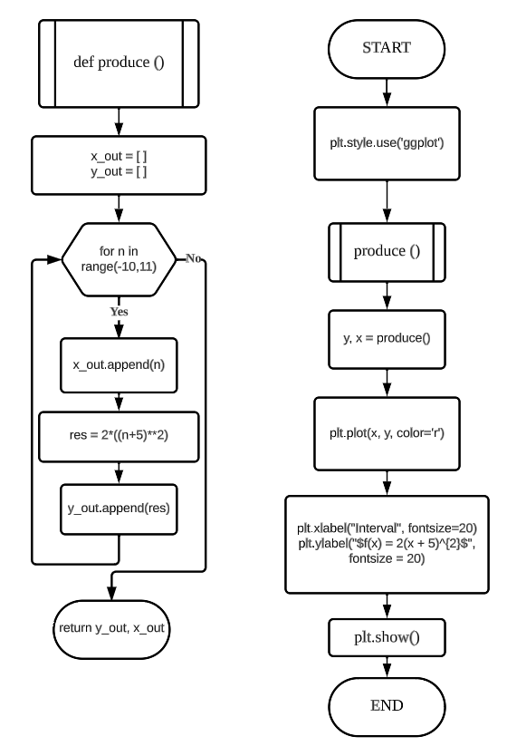
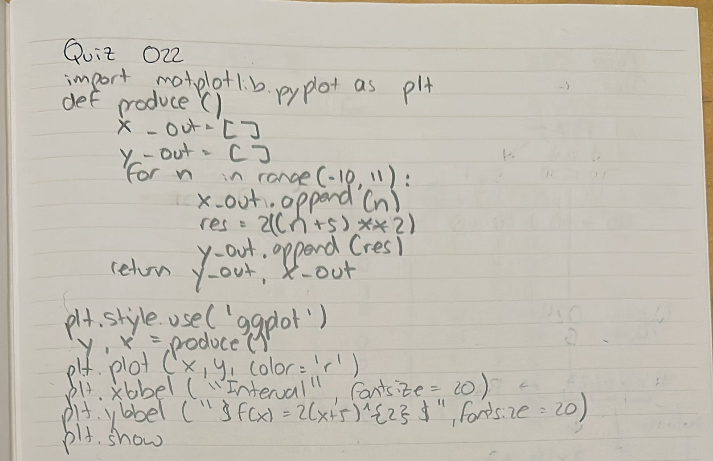
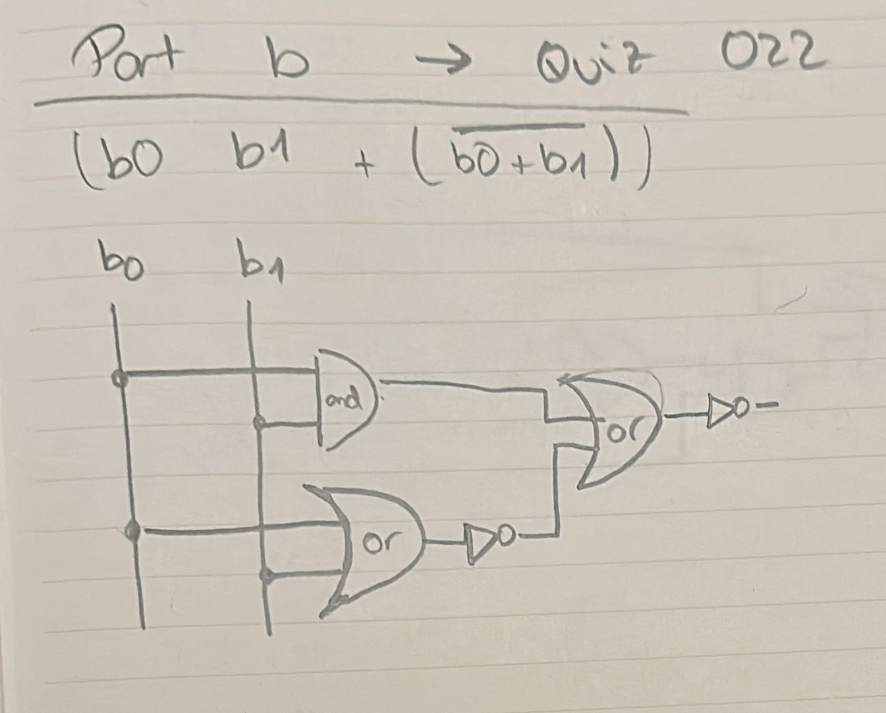

# Quiz 022
## Create a program shows the graph of the parabola for 100 values of x in the interval -10 < x < 10  
### Python Code
```.pycon
import matplotlib.pyplot as plt
def produce():
    x_out = []
    y_out = []
    for n in range(-10,11):
        x_out.append(n)
        res = 2*((n+5)**2)
        y_out.append(res)
    return y_out, x_out

plt.style.use('ggplot')
y, x = produce()
plt.plot(x, y, color='r')
plt.xlabel("Interval", fontsize=20)
plt.ylabel("$f(x) = 2(x + 5)^{2}$", fontsize = 20)
plt.show()
```

### Proof


**Fig.1:** Proof of the Quiz 022

### Flow Chart


**Fig.2:** Flow Chart of the Quiz 022

### Work on paper


**Fig.3:** Work on paper of the Quiz 022

### Part B


**Fig.4:** Part B of the Quiz 022