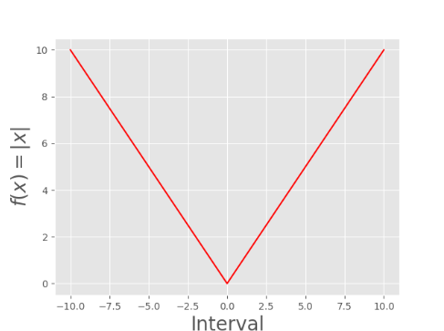
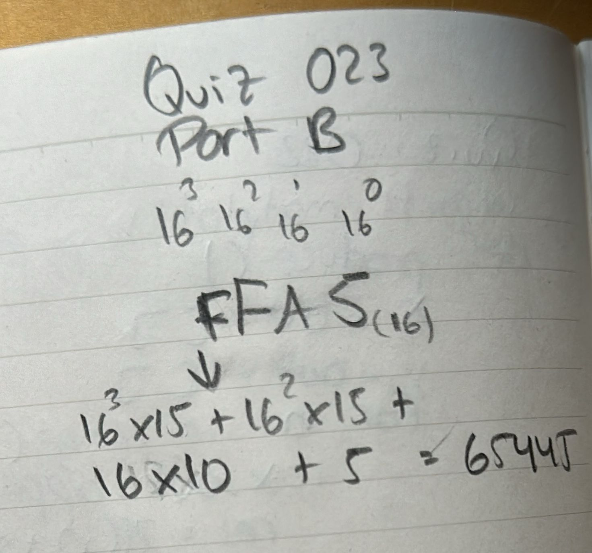

# Quiz 023
## Create a program shows the graph of the function below for 100 values of x in the interval -10 < x < 10
### Python Code
```.py
import matplotlib.pyplot as plt
def produce():
    x_out = []
    y_out = []
    for n in range(-10,11):
        x_out.append(n)
        y_out.append(abs(n))
    return y_out, x_out

plt.style.use('ggplot')
y, x = produce()
plt.plot(x, y, color='r')
plt.xlabel("Interval", fontsize=20)
plt.ylabel("$f(x) = |x|$", fontsize=20)
plt.show()
```

### Proof


**Fig.1:** Proof of the Quiz 023

### Flow Chart


**Fig.2:** Flow Chart of the Quiz 023

### Part B


**Fig.3:** Part B of the Quiz 023