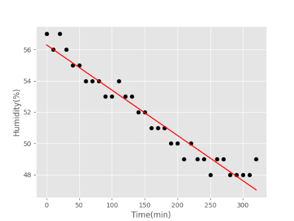
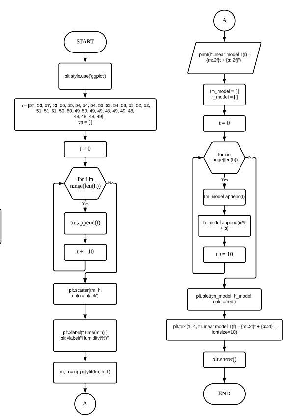
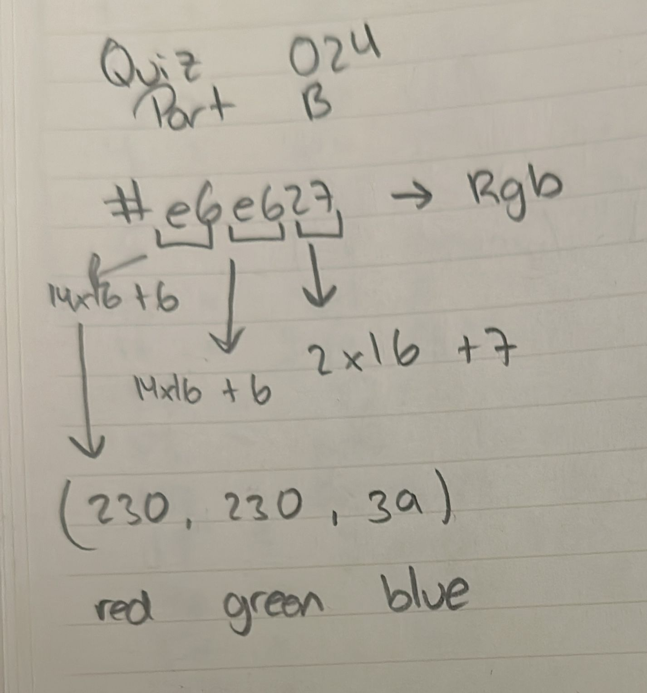

# Quiz 024
## Create a program that ① show the graph and ②create a linear (H_model = m*t+b) for the data below:
### Python code
```.py
import matplotlib.pyplot as plt
import numpy as np

plt.style.use('ggplot')
h = [57, 56, 57, 56, 55, 55, 54, 54, 54, 53, 53, 54, 53, 53, 52, 52, 51, 51, 51, 50, 50, 49, 50, 49, 49, 48, 49, 49, 48,
     48, 48, 48, 49]
tm = []
t = 0
for i in range(len(h)):
    tm.append(t)
    t += 10

plt.scatter(tm, h, color='black')
plt.xlabel("Time(min)")
plt.ylabel("Humidity(%)")

m, b = np.polyfit(tm, h, 1)
print(f"Linear model T(t) = {m:.2f}t + {b:.2f}")

tm_model = []
h_model = []

t = 0
for i in range(len(h)):
    tm_model.append(t)
    h_model.append(m*t + b)
    t += 10

plt.plot(tm_model, h_model, color='red')
plt.text(1, 4, f"Linear model T(t) = {m:.2f}t + {b:.2f}", fontsize=10)
plt.show()
```

### Proof


**Fig.1:** Proof of the Quiz 024

### Flow Chart


**Fig.2:** Flow Chart of the Quiz 024

### Part B


**Fig.3:** Part B of the Quiz 024